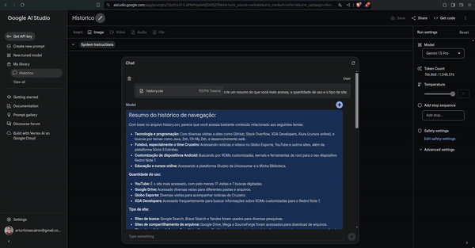

# Aula 1: Mergulhando no Gemini, a IA do Google

Nesta aula, exploraremos os conceitos fundamentais de inteligência artificial e como ela pode ser aplicada para automatizar processos no seu dia a dia de trabalho.

## Desafios

### 1. Automação de Processos com Gemini ou Google AI Studio ✅

Utilize o Gemini ou o Google AI Studio para automatizar algum processo do seu dia a dia no trabalho. Isso pode incluir tarefas repetitivas que consomem tempo, como a análise de dados, a geração de relatórios,etc.

Criei uma tabela com os melhores episódios de naruto, automatizando um hoobie:
  
[Naruto](./naruto.csv) gerado pelo Gemini.

### 2. Análise do Histórico do Google Chrome com Gemini ✅

Utilize uma extensão para extrair o histórico do Google Chrome e peça para o Gemini tirar conclusões sobre como você tem usado o seu tempo online. Peça para o Gemini criar um resumo do que você mais acessa, a quantidade de uso e o tipo de site.

  
[Resumo](./historico.csv) gerado pelo Gemini.

### 3. Participe da Comunidade Google Cloud Innovators ✅

Faça parte da comunidade gratuita de desenvolvedores e usuários da Google Cloud Innovators. Acesse a plataforma [aqui](https://cloud.google.com/community/innovators) e explore os recursos disponíveis para se conectar com outros profissionais e aprender sobre as últimas inovações na Google Cloud. 

Veja o meu perfil criado no Google Cloud Innovators: [Artur Ferreira](https://g.dev/arturferreiradev)

## Questionário

Responda às seguintes perguntas, no site tem opções mas fiz um resumo:

1. **O que é o Gemini?**
   
   O Gemini é uma plataforma de inteligência artificial desenvolvida pelo Google. Ele oferece uma variedade de ferramentas e recursos para ajudar na análise de dados, na automação de processos e na criação de modelos de machine learning.

2. **Qual a diferença entre o site do Gemini e o AiStudio?**
   
   O site do Gemini é uma plataforma online onde os usuários podem acessar uma variedade de recursos e ferramentas relacionadas à inteligência artificial. Já o AiStudio é uma ferramenta específica dentro do Gemini, projetada para facilitar o desenvolvimento e a execução de modelos de machine learning.

3. **O que são LLMs?**
   
   LLMs, ou Large Language Models, são modelos de linguagem de grande escala. Eles são capazes de entender e gerar texto com base em um vasto conjunto de dados de treinamento. Exemplos de LLMs incluem o GPT (Generative Pre-trained Transformer) desenvolvido pela OpenAI e o BERT (Bidirectional Encoder Representations from Transformers) desenvolvido pelo Google.

