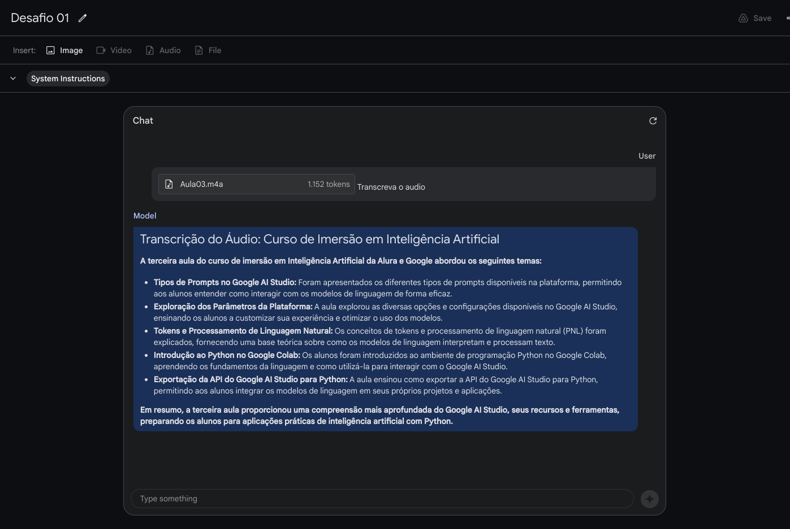
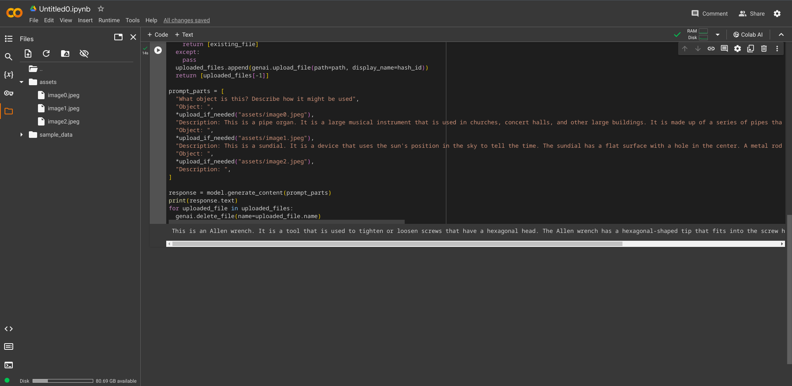
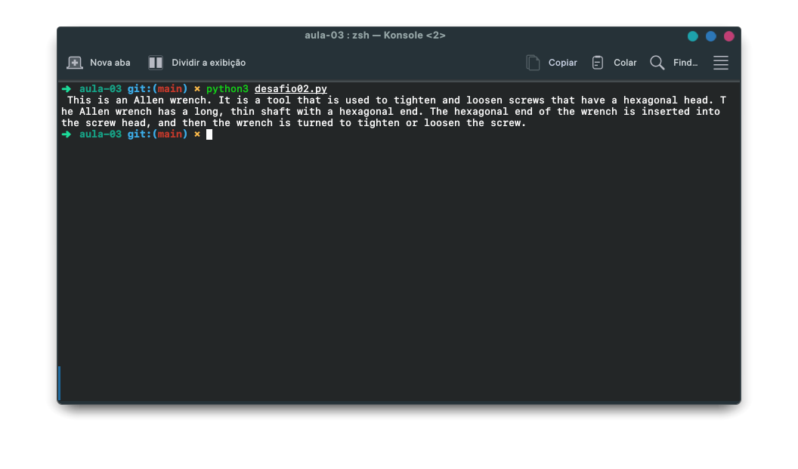
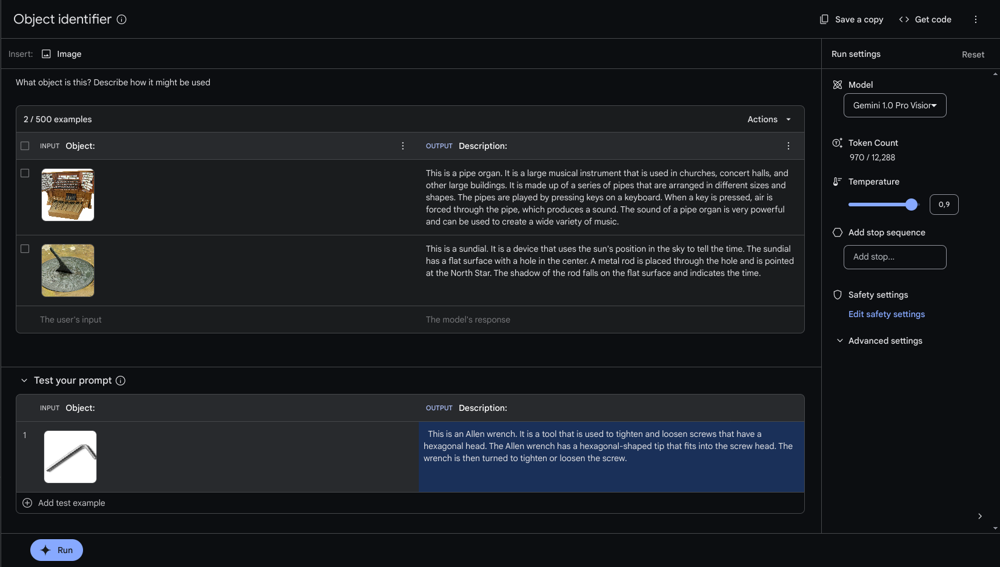
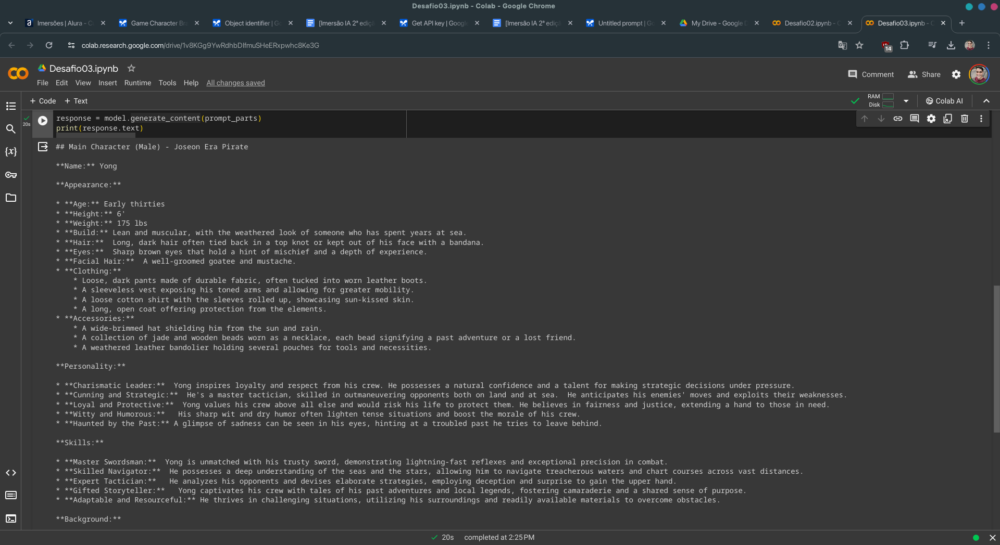
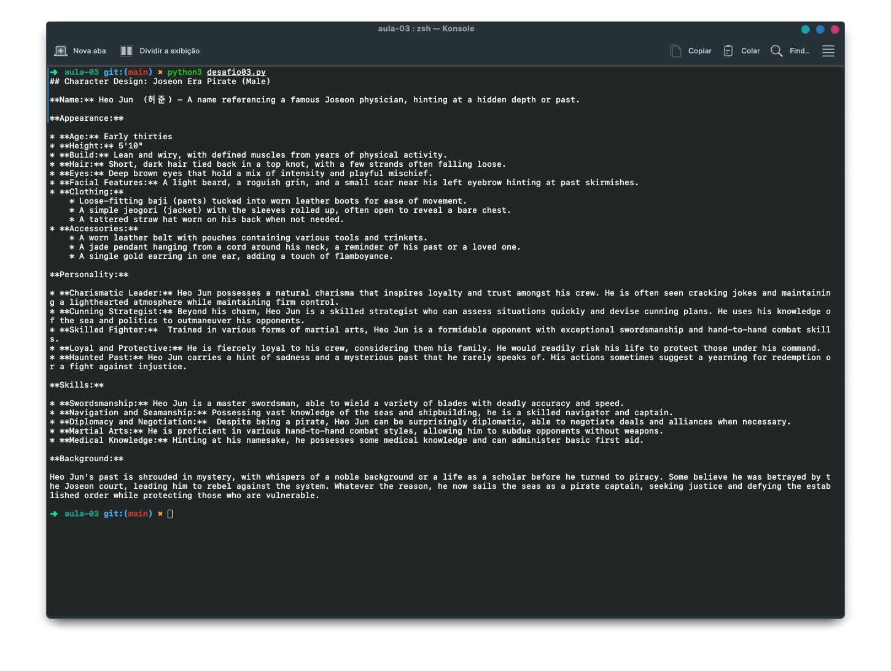
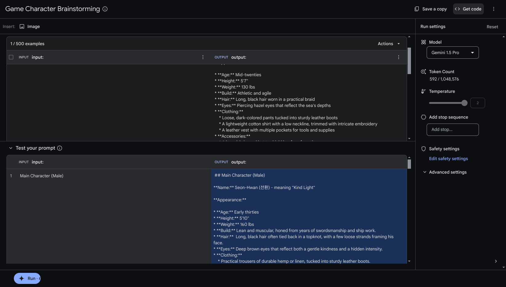

# Aula 03: Explorando os parâmetros do Google AI Studio

## Google AI Studio: Tipos de Prompts
- Existem três tipos de prompts no Google AI Studio:
  1. **Chat prompts:** para interações estilo conversa.
  2. **Freeform prompts:** para inputs de texto livre.
  3. **Structured prompts:** para inputs estruturados.

## Explorando Parâmetros
- É importante entender os parâmetros do Google AI Studio para otimizar o desempenho e os resultados.

## Tokens e Processamento de Linguagem Natural (PLN)
- Tokens são unidades básicas de texto, fundamentais para o processamento de linguagem natural.
- O PLN é uma área de estudo que se concentra na interação entre computadores e linguagem humana.

## Introdução ao Python via Google Colab
- O Google Colab é uma plataforma útil para iniciar o aprendizado de Python, oferecendo recursos como notebooks colaborativos e acesso fácil a recursos de computação.
- Acessar através do Python a API do Goole AI Studio para projetos próprios

## Desafios
1. **Criar um áudio próprio e realizar um prompt para análise no Google AI Studio.** ✅

 gerada através do input do áudio no [Google AI Studio](https://aistudio.google.com/).

2. **Pesquisar como integrar a imagem do Google AI Studio dentro do código Python no Google Colab.** ✅

Integração realizada no Colab.

Integração realizada no meu computador.

Ambos executaram corretamente com a mesma resposta dentro do Google AI Studio.

Acesse o código gerado [aqui](desafio02.py), lembre-se de inserir sua API KEY.

3. **Exportar códigos sem imagens do AI Studio para o Google Colab.** ✅

Integração realizada no Colab.

Integração realizada no meu computador.

Ambos executaram corretamente com a mesma resposta dentro do Google AI Studio.

Acesse o código gerado [aqui](desafio03.py), lembre-se de inserir sua API KEY.

Com estes desafios pude a aplicar na prática os conceitos aprendidos, promovendo uma compreensão mais profunda e prática das habilidades desenvolvidas durante a aula.
