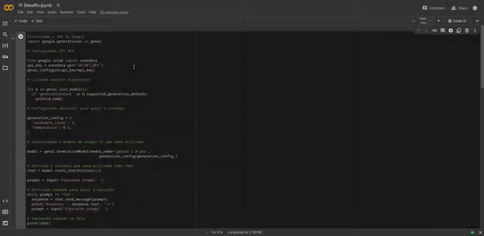

# Criando meu Próprio Chatbot com a Gemini API no Google Colab

Nesta aula, aprendi como criar um chatbot usando a Gemini API e executá-lo no Google Colab, utilizando Python. A Gemini API é uma ótima ferramenta para criar chatbots inteligentes e interativos, e o Google Colab é uma plataforma conveniente para desenvolver e executar código Python, especialmente se você estiver trabalhando com recursos computacionais intensivos, como processamento de linguagem natural.

## Passos para Criar o Chatbot:

### 1. Configurando o Ambiente no Google Colab

- Acesse o [Google Colab](https://colab.research.google.com/) com sua conta Google.
- Crie um novo notebook Python.

### 2. Obtendo as Credenciais do Google AI Studio

- Acesse o site da [Google AI Studio](https://aistudio.google.com/) e crie a sua API KEY.

### 3. Explicação do código

- **Instalação do SDK do Google AI**: Instala o pacote google-generativeai, que é o SDK necessário para interagir com os modelos de IA da Google.

```python
!pip install -q -U google-generativeai
```

- **Configurações iniciais**: Importa o pacote google.generativeai para utilizar as funcionalidades do SDK.

```python
import google.generativeai as genai
```

- **Configuração da API KEY**: Obtém a chave da API do ambiente do Google Colab.

```python
from google.colab import userdata
api_key = userdata.get("SECRET_KEY")
genai.configure(api_key=api_key)
```

- **Listagem de modelos disponíveis**: Lista os modelos disponíveis que suportam a geração de conteúdo.

```python
for m in genai.list_models():
    if 'generateContent' in m.supported_generation_methods:
        print(m.name)
```

- **Configuração das variáveis para gerar o conteúdo**: Define algumas configurações para a geração do conteúdo, como o número de respostas candidatas e a capacidade de criatividade do chatbot.

- **Seleção do modelo do Google AI**: Seleciona o modelo Gemini-1.0-pro para ser utilizado.

```python
model = genai.GenerativeModel(model_name='gemini-1.0-pro', 
								generation_config=generation_config,)
```

- **Inicialização do chat**: Inicia o chat com base no modelo selecionado.

```python
chat = model.start_chat(history=[])
```

- **Interatividade do chat**: O usuário pode fornecer prompts para iniciar o chat, e o código responderá às entradas do usuário até que o comando "fim" seja inserido.

```python
prompt = input('Esperando prompt: ')

while prompt != "fim":
    response = chat.send_message(prompt)
    print("Resposta:", response.text, '\n')
    prompt = input('Esperando prompt: ')
```

- **Visualização do histórico**: Após a interação do chat, o histórico das mensagens é exibido com uma formatação melhorada.

```python
import textwrap
from IPython.display import display
from IPython.display import Markdown

def to_markdown(text):
    text = text.replace('•', '  *')
    return Markdown(textwrap.indent(text, '> ', predicate=lambda _: True))

#Imprimindo o histórico
for message in chat.history:
    display(to_markdown(f'**{message.role}**: {message.parts[0].text}'))
    print('-------------------------------------------')
```
Esse [código](Desafio.ipynb) permite a criação de um chatbot interativo utilizando o modelo Gemini-1.0-pro da Google AI, onde o usuário pode enviar mensagens de prompt e receber respostas do chatbot. O histórico da conversa também é exibido no final.

Execução do código no Colab:



## Conclusão

Ao longo desse processo, aprendi a configurar o ambiente de desenvolvimento, integrar a API necessária e personalizar o comportamento do chatbot para atender às nossas necessidades específicas. Ao criar e experimentar com este chatbot, adquiri habilidades valiosas em desenvolvimento de IA, resolução de problemas e colaboração com tecnologias de ponta. Este é apenas o começo da jornada na exploração do vasto e emocionante campo da inteligência artificial, e estou ansioso para ver os caminhos que ela me proporcionará.


